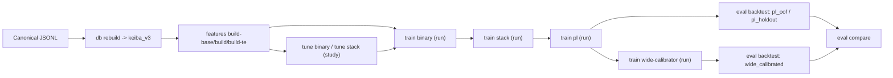
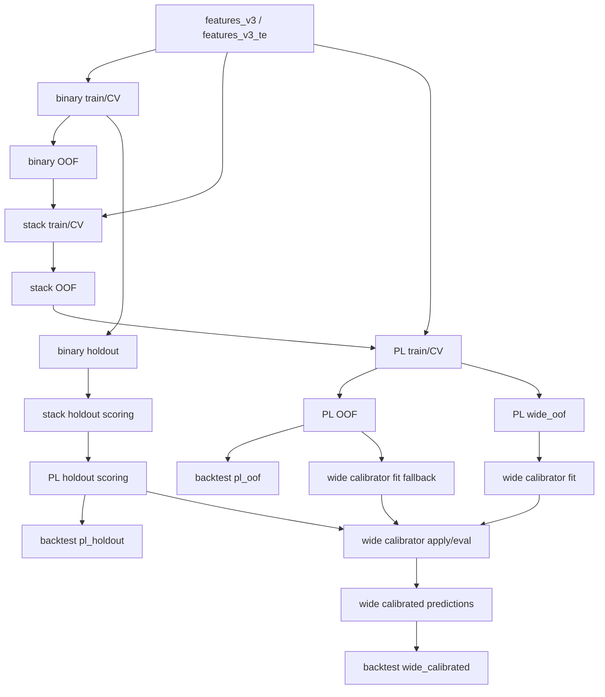
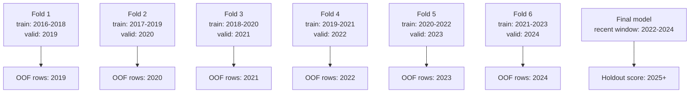
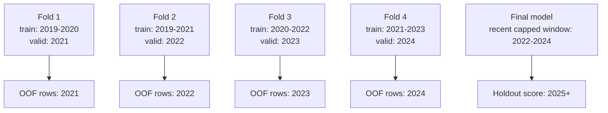

# Architecture And CV

このファイルは、architecture と CV / OOF の流れを図で読むための visual guide です。  
細かい契約は `feature-and-odds.md`, `binary-stacker-and-calibration.md`, `pl-inference-and-wide-backtest.md` を見てください。

## 1. System map

見方:
- `study` は tune の mutable state
- `run` は train / eval の固定比較単位
- `compare` は `metrics.json` を読む派生処理で、source of truth ではありません

## 2. Layer dependency and OOF usage

重要:
- stacker は binary OOF を train/CV に使い、binary holdout を holdout scoring に使います
- PL は stack OOF を train/CV に使い、stack holdout を holdout scoring に使います
- wide calibrator は PL wide OOF を第一候補、horse-level PL OOF を fallback にして fit し、PL holdout に apply/eval します
- `source_run_id` を変えると、これら upstream OOF / holdout の参照元 run を切り替えられます

## 3. CV split matrix
| layer | train rows | valid rows | holdout rows | CV policy | OOF artifact | downstream use |
|---|---|---|---|---|---|---|
| binary | `year < holdout_year` | 各 fold の `valid_year` | `year >= holdout_year` | fixed-sliding 3y | `win/place_<model>_oof.parquet` | stacker |
| stacker | `year < holdout_year` かつ binary OOF が必要 | capped-expanding の `valid_year` | `year >= holdout_year` かつ binary holdout が必要 | capped-expanding `min=2 max=3` | `<task>_stack_oof.parquet` | PL |
| PL | `year < holdout_year` かつ stack OOF が必要 | fixed-sliding の `valid_year` | `year >= holdout_year` かつ stack holdout が必要 | fixed-sliding 3y | `pl_<profile>_oof.parquet` | backtest / inspection |
| wide calibrator | PL OOF / wide OOF | yearly fold CV なし | `pl_<profile>_holdout_<holdout_year>.parquet` | OOF fit / holdout apply | `pl_<profile>_wide_oof.parquet` or `pl_<profile>_oof.parquet` | `wide_calibrated` backtest |
| backtest | train/valid split を作らない | なし | `valid_year < filter_year` の選択 | CV ではない | なし | compare |

## 4. Binary and PL fixed-sliding example
例として available years が `2016-2025`, `holdout_year = 2025`, `train_window_years = 3` のとき:

この policy を使う層:
- binary
- PL

ただし PL は upstream の stacker OOF coverage に制約されます。  
`2016-2025`, `holdout_year=2025` の repo-level cascade では、PL OOF valid year は `2024` のみになります。

評価指標:
- 同じ fold split 上で `logloss`, `brier`, `auc`, `ece` を計算します
- `win` binary だけは同じ split 上で Benter 指標も追加します
- metric によって split が変わるわけではありません

## 5. Stacker capped-expanding example
例として `2016-2025`, `holdout_year = 2025` で binary OOF valid years が `2019-2024`,
`min_train_years = 2`, `max_train_years = 3` のとき:

見方:
- 初期 fold では expanding
- 3 年に達した後は recent 3 years に cap されます
- stacker の `train_window_years` は実質 `max_train_years` を表します

## 6. Backtest is not CV
backtest は fold CV ではありません。

- `pl_oof`
  - すでに作った OOF prediction を後から評価する
- `pl_holdout`
  - holdout prediction を後から評価する
- `wide_calibrated`
  - calibrated pair prediction を後から評価する

repo-level wrapper の holdout-year rule:
- `pl_oof`
  - `holdout_year` をそのまま使う
- `pl_holdout`, `wide_calibrated`
  - `holdout_year + 1` を下位 script に渡す

これは backtest script が `valid_year < filter_year` で rows を選ぶためです。

## 7. What changes and what does not
### 7.1 What changes by layer
- CV policy
  - binary / PL は fixed-sliding
  - stacker は capped-expanding
- upstream dependency
  - stacker は binary OOF / holdout
  - PL は stack OOF / holdout
  - wide calibrator は PL OOF / wide OOF で fit し、PL holdout に apply します

### 7.2 What does not change by metric
- `logloss`
- `brier`
- `auc`
- `ece`
- Benter

これらは「同じ split の上で計算する metric」が違うだけです。  
split policy 自体は layer が決めます。
