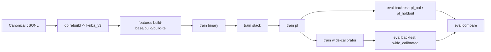

# Architecture

## Summary
- この repo は research-only です。
- repo 全体の目的、対象レース、比較単位は `project-purpose-and-scope.md` にまとめます。
- 比較の source of truth は `run`、探索の source of truth は `study`、特徴量切替の source of truth は `feature_profile` です。
- production 用の `current default` や global manifest は持ちません。
- 旧 repo の shared runtime を前提にせず、この repo 単体で研究を完結させます。

図で見たい場合は `architecture-and-cv.md` を先に読んでください。

用語の意味は `docs/specs/glossary.md` を優先します。

## Repository shape
```text
repo/
├── AGENTS.md
├── README.md
├── keiba_research/
├── src/keiba_research/
├── scripts_v3/
├── migrations_v3/
├── test_v3/
├── docs/
│   ├── specs/
│   └── history/
└── .agents/
```

## What lives where
- `keiba_research/`
  - `python -m keiba_research` の package entrypoint
- `src/keiba_research/common/`
  - `V3_ASSET_ROOT`、run/study/feature build の path 契約、bundle 更新 helper
- `src/keiba_research/db/`
  - DB command registration と DB helper
- `src/keiba_research/rebuild/`
  - rebuild 時に使う parser 実装
- `src/keiba_research/features/`
  - feature build command registration
- `src/keiba_research/training/`
  - binary / stack / PL / wide calibrator を run bundle に保存する command
- `src/keiba_research/tuning/`
  - Optuna study の作成、resume、read-only seed ガード
- `src/keiba_research/evaluation/`
  - backtest と run compare
- `src/keiba_research/importing/`
  - legacy tuning result の one-shot import
- `scripts_v3/`
  - CLI から呼ぶ curated subset の既存 v3 実装
- `migrations_v3/`
  - `keiba_v3` の schema migration
- `test_v3/`
  - research repo の契約テスト

## Dependency direction
依存方向は次です。

```text
python -m keiba_research
  -> src/keiba_research/<domain>/commands.py
  -> scripts_v3/*
  -> keiba_research.db.database / keiba_research.rebuild.parsers
  -> PostgreSQL / V3_ASSET_ROOT
```

重要な点:
- public surface は repo-level CLI です。
- `scripts_v3/` は内部実装として残しており、public API ではありません。
- `src/keiba_research/common/` が asset root / bundle / config の永続契約を持ちます。

## One-glance map


CV / OOF の詳細図は `architecture-and-cv.md` を見てください。

## Public surface
この repo の public entrypoint は次です。

```bash
python -m keiba_research db ...
python -m keiba_research features ...
python -m keiba_research train ...
python -m keiba_research tune ...
python -m keiba_research eval ...
python -m keiba_research import ...
```

`scripts_v3/` の個別スクリプトは内部実装として残しています。  
新しい運用 docs や自動化は、まず repo-level CLI を前提にします。

## Core concepts
- `run`
  - 固定 config、生成 artifact、少なくとも 1 つの評価結果を持つ比較単位
  - 何か 1 つでも条件を変えるなら別 `run_id`
- `study`
  - Optuna の mutable な探索単位
  - 新規 study は resume 可
  - import した legacy study は read-only seed
  - imported study は provenance を残す例外であり、repo-native study の portability / path-clean 契約の対象外
- `feature_profile`
  - 特徴量契約の識別子
  - baseline と candidate の差分を名前で管理する
- `worktree`
  - コード系統を分けたいときだけ使う
  - 通常の実験比較は worktree ではなく複数 `run` で行う

## Artifact lifecycle
この repo で永続化される主な単位は 4 つです。

1. feature build
- `feature_profile` と `feature_build_id` で識別する
- DB から作る特徴量中間成果物

2. study
- Optuna の mutable state
- tuning により trial が増える

3. run
- train と evaluation の固定結果
- compare の主語になる

4. compare report
- 2 つの run の `metrics.json` 差分
- `cache/compare/` に出る派生物で、source of truth ではない

## Section naming in run bundles
`bundle.json` と `metrics.json` の `sections` は次の命名を使います。
- `binary.<task>.<model>`
- `stack.<task>`
- `pl.<pl_feature_profile>`
- `wide_calibrator.<method>`
- `backtest.<input_kind>`

この命名が compare や後続の読解単位になります。

## End-to-end flow
```text
canonical JSONL
  -> db rebuild
  -> feature build
  -> tune study
  -> train run
  -> backtest
  -> compare runs
```

より具体的には次の依存になります。

```text
db migrate
  -> db rebuild
  -> features build-base
  -> features build
  -> optional features build-te
  -> optional tune binary / tune stack
  -> train binary
  -> train stack
  -> train pl
  -> optional train wide-calibrator
  -> eval backtest
  -> eval compare
```

## Current limitations
- `train pl` の clean な repo-level path は stack 系 profile を前提にしています。
- `meta_default` は下位 script に存在しますが、repo-level wrapper では meta OOF を管理していません。
- `eval backtest --input-kind wide_calibrated` は現在 `isotonic` 出力を前提にしています。
- v1 / v2、UI/API、selection-suite はこの repo では仕様外です。

## Out of scope
- FastAPI / frontend / single-race operational API
- production default promotion
- selection-test suite
- task/lane workflow
- v1 / v2 surface
