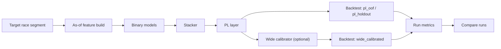

# Project Purpose And Scope

## Purpose
- この repo は、競馬 v3 の研究を把握しやすく、再現しやすく、比較しやすく回すための research-only repo です。
- 目的は、旧 repo の shared runtime や global default に依存せず、1 つの repo 内で feature build から train、backtest、compare までを明示的に扱えるようにすることです。
- production の `current default` を管理する repo ではありません。
- official compare の主語は常に `run` です。

## What This Project Is Trying To Do
この repo が扱う中心課題は次です。

1. 固定した対象レース segment に対して as-of 特徴量を作る
2. binary / stack / PL / wide calibrator を学習する
3. CV metric と batch backtest で結果を固定する
4. 明示した `run_id` 同士を比較する

重要:
- この repo は「今の default を 1 つ決める場所」ではありません。
- この repo は「どの条件の run とどの条件の run を比べるか」を明示する場所です。

## One-Glance View

CV / OOF の split 詳細は `architecture-and-cv.md` を見てください。  
このファイルは「この repo 全体が何を対象に何を比較するか」を先に掴むための overview です。

## Current Research Object
- 入力は `keiba_v3` とそこから作る feature build です。
- 学習は horse-level binary から始まり、stack、PL、wide calibrator へ進みます。
- 評価は CV metric と backtest を `run` に固定保存します。
- compare は `metrics.json` に保存された数値を `run` 単位で比較します。

つまり、この repo の研究対象は「固定 segment 上で、特徴量、upstream model、PL、校正、購入結果がどう変わるか」です。

## Current Target Race Scope
current public pipeline の学習対象レースは feature build の target segment で決まります。  
current implementation の filter は次です。

- `track_code` 01-10
- `surface = 2`
- `race_type_code in {13, 14}`
- `condition_code_min_age in {10, 16, 999}`
- `condition_code_min_age not in {701, 702, 703}`
- `distance_m > 0`
- `field_size > 0`
- `horse_no` は 1-18
- `finish_pos` not null

JV-Data 仕様書での正式な読み替え:
- `track_code` 01-10
  - 中央競馬場コード
- `surface = 2`
  - repo の正規化列です
  - raw JV code ではなく、`2009.トラックコード` の 23-29 をまとめて `2` にしています
  - したがって current target は「中央の平地ダート系 segment」で、サンドも含みます
- `race_type_code 13`
  - `2005.競走種別コード` では `サラブレッド系3歳以上`
- `race_type_code 14`
  - `2005.競走種別コード` では `サラブレッド系4歳以上`
- `condition_code_min_age 10`
  - repo では整数 `10` ですが、JV `2007.競走条件コード` では `010`
  - 名称は `１０００万円以下 ２勝クラス`
- `condition_code_min_age 16`
  - repo では整数 `16` ですが、JV `2007.競走条件コード` では `016`
  - 名称は `１６００万円以下 ３勝クラス`
- `condition_code_min_age 999`
  - `2007.競走条件コード` では `オープン`
- 除外する `701 / 702 / 703`
  - `新馬`, `未出走`, `未勝利`

要するに、current public pipeline は
「中央の平地ダート系で、サラブレッド系3歳以上/4歳以上、2勝クラス/3勝クラス/オープンを中心にした segment」
を研究対象にしています。

## History Scope Vs Target Scope
ここは誤解されやすい点です。

- rolling feature の計算は `from_date - history_days` から `to_date` の広い history scope で行います
- その後で target segment filter を掛け、最終的な `features_base` / `features_v3` を切り出します
- つまり、履歴計算の母集団と最終学習対象レースは同じではありません

さらに最終的な評価対象は、target segment に加えて downstream artifact の有無でも絞られます。

- backtest には prediction 行が必要です
- wide 系 backtest には wide odds と payout が必要です
- したがって最終評価対象は「segment に入り、必要 artifact が揃ったレース」です

## Source Of Truth And Comparison Unit
この repo の比較と変更管理の主語は次です。

- `feature_profile`
  - 特徴量契約の識別子
  - 特徴量集合の差分を切る単位
- `feature_build_id`
  - 同じ `feature_profile` 内で build 期間や build 実行を区別する単位
- `study`
  - Optuna の mutable な探索単位
- `run`
  - train と evaluation を固定保存する比較単位
- `worktree`
  - コード系統そのものを分けたいときだけ増やす単位

運用上の原則:
- 比較の主語は `run`
- tuning の主語は `study`
- 特徴量差分の主語は `feature_profile`
- 通常の比較は新しい `worktree` ではなく複数 `run` で行う

## In Scope
この repo が扱うのは次です。

- `keiba_v3` migration / rebuild
- feature build
- binary / stack / PL / wide calibrator の training
- Optuna tuning
- batch backtest
- run compare
- legacy tuning seed の import

## Out Of Scope
この repo が扱わないのは次です。

- production default promotion
- FastAPI / frontend
- single-race operational API
- selection-suite
- task / lane workflow
- v1 / v2 surface

## What A Reader Should Conclude First
この repo を読むとき、最初に押さえるべき結論は次です。

- これは research-only repo である
- 対象は current implementation が定義する中央の平地ダート系 target segment である
- compare の主語は `run` である
- CV / backtest / compare はその `run` を固定して比較するためにある
- 低レベル implementation を読む前に、目的、対象、比較単位をこのファイルで固定しておく

## Reading Map
- 用語を確認したい
  - `glossary.md`
- repo の構造と責務分担を見たい
  - `architecture.md`
- CV / OOF を図で追いたい
  - `architecture-and-cv.md`
- 保存先と bundle 契約を確認したい
  - `data-contract.md`
- 差分をどの単位で切るかを確認したい
  - `operations.md`
- feature 列、odds snapshot、segment filter の詳細を確認したい
  - `feature-and-odds.md`
- binary / stack / calibrator の detail を確認したい
  - `binary-stacker-and-calibration.md`
- PL / 購入ルール / backtest の detail を確認したい
  - `pl-inference-and-wide-backtest.md`
- compare の読み方を確認したい
  - `evaluation-and-comparison.md`
